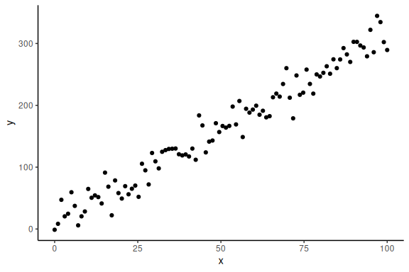
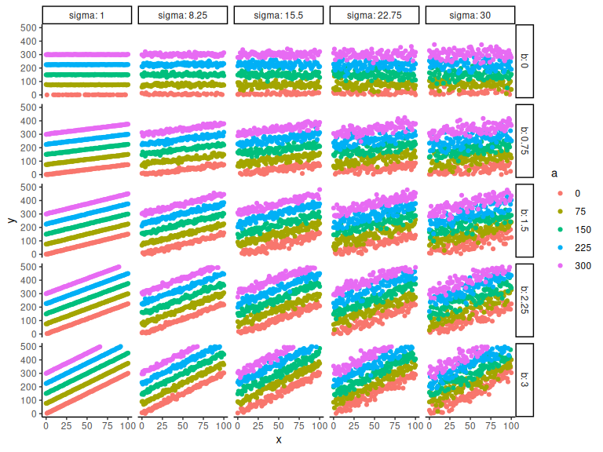
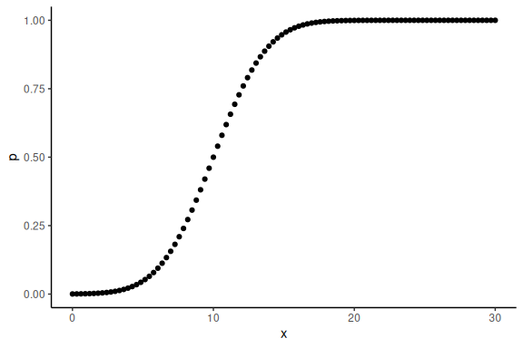
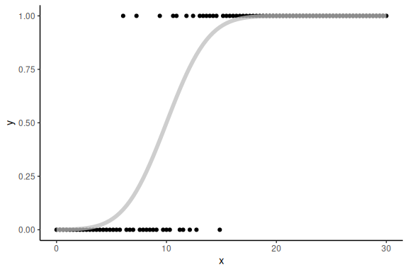
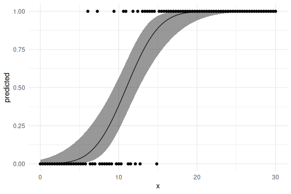
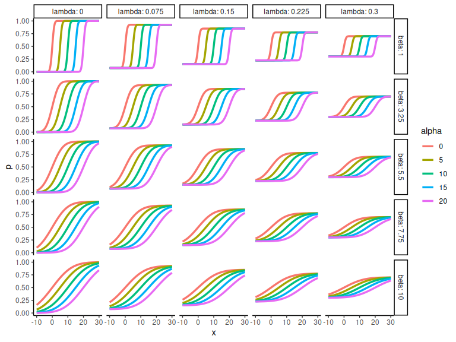

---
categories:
  - Starting Off
excerpt_separator: <!--more-->
---

- Bayesian Workflow

This R markdown document gives an idea of how data
simulation fits into the Bayesian workflow and how to perform this in R.

 <!--more-->
 
## Table of content

- [Overview.](/Data-Simulation/#overview)
- [Simulation (Linear model).](/Data-Simulation/#simulation-linear-model)
- [Generalized simulations (linear model).](/Data-Simulation/#generalized-simulations-linear-model)
- [Psychometric functions.](/Data-Simulation/#psychometric-functions)
- [Generalized simulations (psychometric functions).](/Data-Simulation/#generalized-simulations-psychometric-functions)
- [Final remarks.](/Data-Simulation/#final-remarks)

## Overview.

Data stimulation is not inherently Bayesian, but adopted by many Bayesian statisticians to
ensure that the models used are sensible. In this R-markdown I
demonstrate how data-simulation can be used for a simple linear
regression and later for more complex models such as psychometric
functions. It is important to stress the importance of simulations, as
proper use of simulations can help answer many of the questions people
have about their statistical or computational models. These questions
could be what sample size would i need to detect an effect size of x, or
what what happens to my model if i have a certain type of distributed
data etc.

## Simulation (Linear model).

In order to start appreciating simulations we start by simulating data
from the linear model:

")

Here  is our
outcome of interest and
 is our
independent variable. All other symbols a,b and
 are
parameters that we in the end want to estimate.

To simulate data from this model we choose values for our parameters and
select a range of x-values that would make sense for the experimental
design (levels of the independent variable you have in the experiment).

``` r
#data points
N = 100
#intercept
a = 10
#slope
b = 3
#sigma
sigma = 20
#x's
x = seq(0,100, length.out = N)
```

Now to simulate data we use the distributions build into R. In the above
we specified that the normal distribution, so we use the random number
generator of the normal distribution to get responses
.

``` r
# generate y-values from our model and parameters
y = rnorm(N,a+b*x,sigma)
```

Now importantly we can plot it, ensuring ourselves that it makes sense

``` r
data.frame() %>% 
  ggplot(aes(x =x,y = y))+
  geom_point()+
  theme_classic()
```

<!-- -->

Now that we have some simulated data, where we know the parameters
i.e. a b and
, we
can try and fit the model. We start by doing this in the frequentist
sense:

``` r
# Calling the linear model and plotting as a table
m1 = lm(y~x)
# Making a nice table of the model results
summary(m1)
```

    ## 
    ## Call:
    ## lm(formula = y ~ x)
    ## 
    ## Residuals:
    ##     Min      1Q  Median      3Q     Max 
    ## -49.071 -11.047  -0.692  12.970  41.897 
    ## 
    ## Coefficients:
    ##             Estimate Std. Error t value Pr(>|t|)    
    ## (Intercept)  9.32214    3.63087   2.567   0.0118 *  
    ## x            3.04972    0.06273  48.616   <2e-16 ***
    ## ---
    ## Signif. codes:  0 '***' 0.001 '**' 0.01 '*' 0.05 '.' 0.1 ' ' 1
    ## 
    ## Residual standard error: 18.29 on 98 degrees of freedom
    ## Multiple R-squared:  0.9602, Adjusted R-squared:  0.9598 
    ## F-statistic:  2364 on 1 and 98 DF,  p-value: < 2.2e-16

Here we get the parameters; a (intercept) and b (the slope). These two
estimates are not terribly off the values we put in which where 10 and 3
respectively. To get the last parameter
 we can
do:

``` r
# getting the sigma estimate
sigma(m1)
```

    ## [1] 18.2907

Which is also decently close to the 20 which we simulated.

This markdown is not about fitting models to simulated data, but to
leverage simulations and explore the meaning of these. In the next
section we generalize the scripts for the linear model so we can
investigate the meaning of our parameters. This is meant as an exercise
to understand one of the ways one can use simulations, i.e. to
understand the meaning of the parameters of a model.

## Generalized simulations (linear model).

We start with the same linear model as before, but now simulate several
parameter pairs (i.e. pairs of a,b and
).

``` r
# keep the number of data points constant (could also vary this)
N = 100
#intercept
a = seq(0,300,length.out = 5)
#slope
b = seq(0,3,length.out = 5)
#sigma
sigma = seq(1,30,length.out = 5)

parameters = expand.grid(a = a,
                         b = b,
                         sigma = sigma,
                         N = N)

#lastly we put it together in a dataframe:
df = parameters %>% rowwise() %>% 
  mutate(x = list(seq(0,100, length.out = N))) %>% unnest(x)
```

Now the last part is getting the responses
i.e. .

``` r
# getting the y_i
df = df %>% mutate(y = rnorm(n(),a+b*x,sigma))
```

And we can then plot the different combinations. Here I color by the
intercept and have the facets as the slope and sigma parameter:

``` r
df %>% 
  # Make parameters factors:
  mutate(a = as.factor(a), b = as.factor(b), sigma = as.factor(sigma)) %>% 
  # Ggplot
  ggplot(aes(x = x, y = y, col = a))+
  # Set y-limits
  scale_y_continuous(limits = c(0,500))+
  # Grids for slope and sigma
  facet_grid(b~sigma, scales = "free", labeller = label_both)+
  # Ppoints
  geom_point()+
  # Theme
  theme_classic()
```

    ## Warning: Removed 605 rows containing missing values or values outside the scale range
    ## (`geom_point()`).

<!-- -->

Hopefully its clear that the a parameter is the intersection i.e. the
y-value when x = 0. The parameter b represents the slope of the line,
higher b, steeper lines. Lastly sigma represents the spread of data
points, higher values represents greater spread.

## Psychometric functions.

Now we do the same for a psychometric function to take an example a bit
less known. The psychometric function is a function that maps continuous
values
\];
\[ to
probabilities \[0 ; 1\].

The most common function to use is the cumulative normal distribution or
the probit model with the functional form:

")

Here  represents
the probability of answering 1, and x represents the independent
variable that when increases increases the probability of responding 1.

In the same vain as with the normal distribution we simulate
probabilities, from simulated values of the parameters
( &
) and the
independent variable
.

``` r
#data points
N = 100
#threshold
alpha = 10
#slope
beta = 3
#x's
x = seq(0,30, length.out = N)
```

We can then obtain the probabilities by writing the formula:

``` r
# getting the probabilities from the model and the parameters
p = 0.5+0.5*pracma::erf((x-alpha)/(sqrt(2)*beta))
```

Now importantly we can plot it ensuring ourselves that it makes sense

``` r
data.frame() %>% ggplot(aes(x =x,y = p))+geom_point()+theme_classic()
```

<!-- -->

The additional thing here is that we do not observe these probabilities,
but the realization of these (i.e. the actual binary responses that come
from these probabilities). In order to simulate this we need another
probability density function (just as we used the normal distribution to
get noise about our y_i’s) here the binominal distribution which
converts probabilities to binary responses
:

``` r
# generating binary responses from the probabilities above
y = rbinom(N,1,p)
```

We can then plot the binary realization of the probabilities as well as
the curve from above:

``` r
data.frame() %>% 
  ggplot(aes(x =x,y = y))+
  geom_point()+
  theme_classic()+
  geom_line(aes(x = x, y = p), col = "grey", alpha = 0.75, linewidth = 2)
```

<!-- -->

Now we can again fit this using normal linear modeling.

This would be done by with the following code:

``` r
# fittiing the model using generalized linear model and plotting as a table
m1 = glm(y ~ x, family = binomial(link = "probit"))
summary(m1)
```

    ## 
    ## Call:
    ## glm(formula = y ~ x, family = binomial(link = "probit"))
    ## 
    ## Coefficients:
    ##             Estimate Std. Error z value Pr(>|z|)    
    ## (Intercept) -3.35084    0.72546  -4.619 3.86e-06 ***
    ## x            0.30516    0.06272   4.866 1.14e-06 ***
    ## ---
    ## Signif. codes:  0 '***' 0.001 '**' 0.01 '*' 0.05 '.' 0.1 ' ' 1
    ## 
    ## (Dispersion parameter for binomial family taken to be 1)
    ## 
    ##     Null deviance: 131.791  on 99  degrees of freedom
    ## Residual deviance:  39.341  on 98  degrees of freedom
    ## AIC: 43.341
    ## 
    ## Number of Fisher Scoring iterations: 8

As can be seen the output is quite different which relates to the how
the model is specified, this is beyond the scope of this Markdown, but
it suffices to plot the outcome of the model and indeed show its the
same as out simulation:

``` r
# Plotting the marginal effects of the model
effects = ggpredict(m1,terms = "x [all]")


# the plot below is commented out as it does not knit (I do not know why)

data.frame(effects) %>%
  ggplot(aes(x = x, y = predicted))+
  geom_line()+geom_ribbon(aes(ymin = conf.low, ymax = conf.high), alpha = 0.5)+
  geom_point(data = data.frame(x =x,y = y), aes(x = x ,y = y))+
  theme_minimal()
```

<!-- -->

## Generalized simulations (psychometric functions).

Now we can do the same step as we did with the linear model of plotting
many different combinations of parameters values of the function. Before
doing this we introduce a third parameter of the psychometric, which
means that the functional relationship between our independent variable
 and the
probability  is
now:

 * \left(0.5 + 0.5 \cdot erf\left(\frac{x_i - \alpha }{\beta \cdot \sqrt{2}}\right)\right)")

The 3 parameters
,
,
 are
called lapse rate, threshold and slope respectively. This hopefully
becomes clear below.

``` r
# keep the number of data points constant (could also vary this)
N = 200
#intercept
alpha = seq(0,20,length.out = 5)
#slope
beta = seq(1,10,length.out = 5)
#sigma
lambda = seq(0,0.3,length.out = 5)

parameters = expand.grid(alpha = alpha,
                         beta = beta,
                         lambda = lambda,
                         N = N)

#lastly we put it together in a dataframe:
df = parameters %>% rowwise() %>% 
  mutate(x = list(seq(-10,30, length.out = N))) %>% 
  unnest(x)
```

Now we calculate the latent (unobserved) probability,
.

``` r
# define function based on functional relationship
psycho = function(x,alpha,beta,lambda){
  return(lambda + (1-2*lambda) * (0.5+0.5*pracma::erf((x-alpha)/(beta*sqrt(2)))))
}
# getting the p_i and afterwards geting the binary responses based on p
df = df %>% 
  mutate(p = psycho(x,alpha,beta,lambda)) %>% 
  mutate(y = rbinom(n(),1,p))
```

And we can then plot the different combinations (here we plot the
probabilities) as the binary responses gets messy.

``` r
df %>% 
  # Make parameters factors
  mutate(alpha = as.factor(alpha), beta = as.factor(beta), lambda = as.factor(lambda)) %>% 
  # ggplot
  ggplot(aes(x = x, y = p, col = alpha))+
  # scale the y axiis
  scale_y_continuous(limits = c(0,1))+
  # Gris the lapse and the slope
  facet_grid(beta~lambda, scales = "free", labeller = label_both)+
  # draw the lines
  geom_line(linewidth = 1.2)+theme_classic()
```

<!-- -->

Hopefully its clear that the

parameter is the x-value where the probability is 0.5 i.e. the x-value
when y = 0. The parameter

represents the slope of the line, higher b less steep lines.

Lastly

represents the lapse rate and governs where the function starts and
ends. i.e. when x -\>
 y
-\> 
and when x -\>
 y -\>
.

## Final remarks.

This finishes the section on data simulation with two simple models.

The main takeaway from this markdown should be that making the
assumptions of the model explicit is relatively easy, and will be
worthwhile when building the model in Stan later.

Understanding what the free parameters of the model mean and what values
are sensible for your problem is vital to the further steps.
