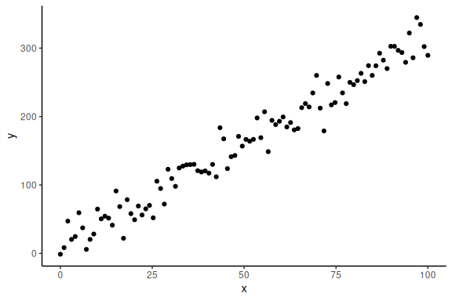

(2) Model fitting to simulated data
================
2025-01-04

- [Overview](/Model-fitting-to-simulated-data/#overview)
- [Draws and summary statistics:](#draws-and-summary-statistics)
- [Posterior predictive checks](#posterior-predictive-checks)
- [Final remarks](#final-remarks)

<!--more-->

## Overview

This R markdown is for model fitting on simulated data.

here we build on the [data simulation R-markdown](/Data-Simulation/) and introduce how to fit
the simulated agents responses in that R-markdown in a Bayesian
framework. This entails estimating the parameter values we put into the
simulations, from our model. This exercise is thus similar to what was
done in the data simulation markdown, however here we write our own
probabilistic model in stan, instead of relying on functionalities built
into R.

We start by using the simulated linear regression from the data
simulation markdown:

``` r
#data points
N = 100
#intercept
a = 10
#slope
b = 3
#sigma
sigma = 20
#x's
x = seq(0,100, length.out = N)
#y's
y = rnorm(N,a+b*x,sigma)
```

Now importantly we can plot it ensuring ourselves that it makes sense

``` r
data.frame() %>% 
  ggplot(aes(x =x,y = y))+
  geom_point()+
  theme_classic()
```

<!-- -->

Now we want to build a Stan model that takes these x and y values and
gives us estimates for our parameters a, b and
.

To make the stan model, we have to write the code ourselves. The process
of writing the Stan program is close to identical to that of simulating
the data.

Stan generally needs 3 main things.

- It needs to know what data you put into it
- The “free” parameters
- Your model. (Note here model just means the thing we specified above
  i.e. "),
  with
  
  being the normal distribution).

The next code chunk is the stan model and is thus not embedded in a
standard R-markdown chunk.

A few things to note about the stan model / chunk.

- The model is called “model_obj2” and can thus later be called in the
  R-session.
- comments are not done with “\#”, but with “//”
- there are 3-main blocks “data{…}” , “parameters{…}” and “model{…}”
- all variables need to be defined in size and type.

``` stan
//This block defines the input that. So these things needs to go into the model
data {
  //Define the number of datapoints this is defined by an integer
  int N;
  //Define a vector called y that is as long as the number of datapoints (i.e. N)
  vector[N] y;
  // same as y but a variable called x our independent variable
  vector[N] x;
}

// This is the parameters block. Here we define the free parameters,
// which are the onces that STAN estimates. This is again a,b and sigma
parameters {
  real a;
  real b;
  real sigma;
}

// This is the model block here we define the model.

model {
  y ~ normal(a+b*x, sigma);
}
```

Now that we have a stan model we need to provide the data such that it
can sample and find the optimal parameters (their distribution). We do
this by calling the model, here called “model_obj2” defined above.

Note usually one writes the stan models in a .stan file and then gets
the model using the following R code “cmdstanr::cmdstan_model(path)”,
with path being the path to the .stan file. Here I’ve embedded it in the
R-code for clarity.

Now we fit the model to the data by entering our data:

``` r
# Fit the STAN model
fit = model_obj2$sample(data = list(N =N, x = x, y =y), seed = seeds)
```

    ## Running MCMC with 4 sequential chains...
    ## 
    ## Chain 1 Iteration:    1 / 2000 [  0%]  (Warmup) 
    ## Chain 1 Iteration:  100 / 2000 [  5%]  (Warmup) 
    ## Chain 1 Iteration:  200 / 2000 [ 10%]  (Warmup) 
    ## Chain 1 Iteration:  300 / 2000 [ 15%]  (Warmup) 
    ## Chain 1 Iteration:  400 / 2000 [ 20%]  (Warmup) 
    ## Chain 1 Iteration:  500 / 2000 [ 25%]  (Warmup) 
    ## Chain 1 Iteration:  600 / 2000 [ 30%]  (Warmup) 
    ## Chain 1 Iteration:  700 / 2000 [ 35%]  (Warmup) 
    ## Chain 1 Iteration:  800 / 2000 [ 40%]  (Warmup) 
    ## Chain 1 Iteration:  900 / 2000 [ 45%]  (Warmup) 
    ## Chain 1 Iteration: 1000 / 2000 [ 50%]  (Warmup) 
    ## Chain 1 Iteration: 1001 / 2000 [ 50%]  (Sampling) 
    ## Chain 1 Iteration: 1100 / 2000 [ 55%]  (Sampling) 
    ## Chain 1 Iteration: 1200 / 2000 [ 60%]  (Sampling) 
    ## Chain 1 Iteration: 1300 / 2000 [ 65%]  (Sampling) 
    ## Chain 1 Iteration: 1400 / 2000 [ 70%]  (Sampling) 
    ## Chain 1 Iteration: 1500 / 2000 [ 75%]  (Sampling) 
    ## Chain 1 Iteration: 1600 / 2000 [ 80%]  (Sampling) 
    ## Chain 1 Iteration: 1700 / 2000 [ 85%]  (Sampling) 
    ## Chain 1 Iteration: 1800 / 2000 [ 90%]  (Sampling) 
    ## Chain 1 Iteration: 1900 / 2000 [ 95%]  (Sampling) 
    ## Chain 1 Iteration: 2000 / 2000 [100%]  (Sampling) 
    ## Chain 1 finished in 0.1 seconds.
    ## Chain 2 Iteration:    1 / 2000 [  0%]  (Warmup) 
    ## Chain 2 Iteration:  100 / 2000 [  5%]  (Warmup) 
    ## Chain 2 Iteration:  200 / 2000 [ 10%]  (Warmup) 
    ## Chain 2 Iteration:  300 / 2000 [ 15%]  (Warmup) 
    ## Chain 2 Iteration:  400 / 2000 [ 20%]  (Warmup) 
    ## Chain 2 Iteration:  500 / 2000 [ 25%]  (Warmup) 
    ## Chain 2 Iteration:  600 / 2000 [ 30%]  (Warmup) 
    ## Chain 2 Iteration:  700 / 2000 [ 35%]  (Warmup) 
    ## Chain 2 Iteration:  800 / 2000 [ 40%]  (Warmup) 
    ## Chain 2 Iteration:  900 / 2000 [ 45%]  (Warmup) 
    ## Chain 2 Iteration: 1000 / 2000 [ 50%]  (Warmup) 
    ## Chain 2 Iteration: 1001 / 2000 [ 50%]  (Sampling) 
    ## Chain 2 Iteration: 1100 / 2000 [ 55%]  (Sampling) 
    ## Chain 2 Iteration: 1200 / 2000 [ 60%]  (Sampling) 
    ## Chain 2 Iteration: 1300 / 2000 [ 65%]  (Sampling) 
    ## Chain 2 Iteration: 1400 / 2000 [ 70%]  (Sampling) 
    ## Chain 2 Iteration: 1500 / 2000 [ 75%]  (Sampling) 
    ## Chain 2 Iteration: 1600 / 2000 [ 80%]  (Sampling) 
    ## Chain 2 Iteration: 1700 / 2000 [ 85%]  (Sampling) 
    ## Chain 2 Iteration: 1800 / 2000 [ 90%]  (Sampling) 
    ## Chain 2 Iteration: 1900 / 2000 [ 95%]  (Sampling) 
    ## Chain 2 Iteration: 2000 / 2000 [100%]  (Sampling) 
    ## Chain 2 finished in 0.1 seconds.
    ## Chain 3 Iteration:    1 / 2000 [  0%]  (Warmup) 
    ## Chain 3 Iteration:  100 / 2000 [  5%]  (Warmup) 
    ## Chain 3 Iteration:  200 / 2000 [ 10%]  (Warmup) 
    ## Chain 3 Iteration:  300 / 2000 [ 15%]  (Warmup) 
    ## Chain 3 Iteration:  400 / 2000 [ 20%]  (Warmup) 
    ## Chain 3 Iteration:  500 / 2000 [ 25%]  (Warmup) 
    ## Chain 3 Iteration:  600 / 2000 [ 30%]  (Warmup) 
    ## Chain 3 Iteration:  700 / 2000 [ 35%]  (Warmup) 
    ## Chain 3 Iteration:  800 / 2000 [ 40%]  (Warmup) 
    ## Chain 3 Iteration:  900 / 2000 [ 45%]  (Warmup) 
    ## Chain 3 Iteration: 1000 / 2000 [ 50%]  (Warmup) 
    ## Chain 3 Iteration: 1001 / 2000 [ 50%]  (Sampling) 
    ## Chain 3 Iteration: 1100 / 2000 [ 55%]  (Sampling) 
    ## Chain 3 Iteration: 1200 / 2000 [ 60%]  (Sampling) 
    ## Chain 3 Iteration: 1300 / 2000 [ 65%]  (Sampling) 
    ## Chain 3 Iteration: 1400 / 2000 [ 70%]  (Sampling) 
    ## Chain 3 Iteration: 1500 / 2000 [ 75%]  (Sampling) 
    ## Chain 3 Iteration: 1600 / 2000 [ 80%]  (Sampling) 
    ## Chain 3 Iteration: 1700 / 2000 [ 85%]  (Sampling) 
    ## Chain 3 Iteration: 1800 / 2000 [ 90%]  (Sampling) 
    ## Chain 3 Iteration: 1900 / 2000 [ 95%]  (Sampling) 
    ## Chain 3 Iteration: 2000 / 2000 [100%]  (Sampling) 
    ## Chain 3 finished in 0.1 seconds.

    ## Chain 4 Rejecting initial value:

    ## Chain 4   Error evaluating the log probability at the initial value.

    ## Chain 4 Exception: normal_lpdf: Scale parameter is -0.650394, but must be positive! (in '/tmp/RtmpSIYSPf/model-1a333c5e14dc.stan', line 22, column 2 to column 27)
    ## Chain 4 Exception: normal_lpdf: Scale parameter is -0.650394, but must be positive! (in '/tmp/RtmpSIYSPf/model-1a333c5e14dc.stan', line 22, column 2 to column 27)

    ## Chain 4 Iteration:    1 / 2000 [  0%]  (Warmup) 
    ## Chain 4 Iteration:  100 / 2000 [  5%]  (Warmup) 
    ## Chain 4 Iteration:  200 / 2000 [ 10%]  (Warmup) 
    ## Chain 4 Iteration:  300 / 2000 [ 15%]  (Warmup) 
    ## Chain 4 Iteration:  400 / 2000 [ 20%]  (Warmup) 
    ## Chain 4 Iteration:  500 / 2000 [ 25%]  (Warmup) 
    ## Chain 4 Iteration:  600 / 2000 [ 30%]  (Warmup) 
    ## Chain 4 Iteration:  700 / 2000 [ 35%]  (Warmup) 
    ## Chain 4 Iteration:  800 / 2000 [ 40%]  (Warmup) 
    ## Chain 4 Iteration:  900 / 2000 [ 45%]  (Warmup) 
    ## Chain 4 Iteration: 1000 / 2000 [ 50%]  (Warmup) 
    ## Chain 4 Iteration: 1001 / 2000 [ 50%]  (Sampling) 
    ## Chain 4 Iteration: 1100 / 2000 [ 55%]  (Sampling) 
    ## Chain 4 Iteration: 1200 / 2000 [ 60%]  (Sampling) 
    ## Chain 4 Iteration: 1300 / 2000 [ 65%]  (Sampling) 
    ## Chain 4 Iteration: 1400 / 2000 [ 70%]  (Sampling) 
    ## Chain 4 Iteration: 1500 / 2000 [ 75%]  (Sampling) 
    ## Chain 4 Iteration: 1600 / 2000 [ 80%]  (Sampling) 
    ## Chain 4 Iteration: 1700 / 2000 [ 85%]  (Sampling) 
    ## Chain 4 Iteration: 1800 / 2000 [ 90%]  (Sampling) 
    ## Chain 4 Iteration: 1900 / 2000 [ 95%]  (Sampling) 
    ## Chain 4 Iteration: 2000 / 2000 [100%]  (Sampling)

    ## Chain 4 Informational Message: The current Metropolis proposal is about to be rejected because of the following issue:

    ## Chain 4 Exception: normal_lpdf: Scale parameter is -37.9931, but must be positive! (in '/tmp/RtmpSIYSPf/model-1a333c5e14dc.stan', line 22, column 2 to column 27)

    ## Chain 4 If this warning occurs sporadically, such as for highly constrained variable types like covariance matrices, then the sampler is fine,

    ## Chain 4 but if this warning occurs often then your model may be either severely ill-conditioned or misspecified.

    ## Chain 4

    ## Chain 4 Informational Message: The current Metropolis proposal is about to be rejected because of the following issue:

    ## Chain 4 Exception: normal_lpdf: Scale parameter is -1.51177, but must be positive! (in '/tmp/RtmpSIYSPf/model-1a333c5e14dc.stan', line 22, column 2 to column 27)

    ## Chain 4 If this warning occurs sporadically, such as for highly constrained variable types like covariance matrices, then the sampler is fine,

    ## Chain 4 but if this warning occurs often then your model may be either severely ill-conditioned or misspecified.

    ## Chain 4

    ## Chain 4 Informational Message: The current Metropolis proposal is about to be rejected because of the following issue:

    ## Chain 4 Exception: normal_lpdf: Scale parameter is -62.9655, but must be positive! (in '/tmp/RtmpSIYSPf/model-1a333c5e14dc.stan', line 22, column 2 to column 27)

    ## Chain 4 If this warning occurs sporadically, such as for highly constrained variable types like covariance matrices, then the sampler is fine,

    ## Chain 4 but if this warning occurs often then your model may be either severely ill-conditioned or misspecified.

    ## Chain 4

    ## Chain 4 finished in 0.1 seconds.
    ## 
    ## All 4 chains finished successfully.
    ## Mean chain execution time: 0.1 seconds.
    ## Total execution time: 0.7 seconds.

There is a lot of output when you make stan sample your model, this we
will come back to. The main things to be aware of at this point is the
output in the end.

Here stan will provide the summary of the diagnostics, which include
divergences, tree depths and energy of the sampler. This markdown won’t
go into these, but usually if Stan complains (red text) about these it
is necessary to go back to the stan code as there is most likely a
mistake. See the diagnostic R-markdown.

We can now look into the model fit, this can be done in several ways.
Firstly we can just call the model object:

``` r
# calling the fitted object
fit
```

    ##  variable    mean  median   sd  mad      q5     q95 rhat ess_bulk ess_tail
    ##     lp__  -341.21 -340.90 1.27 1.06 -343.69 -339.80 1.00     1584     2345
    ##     a        9.35    9.30 3.74 3.66    3.25   15.68 1.00     1803     1716
    ##     b        3.05    3.05 0.07 0.06    2.94    3.15 1.00     1771     1722
    ##     sigma   18.61   18.52 1.36 1.36   16.54   20.92 1.00     2065     2025

This outputs the summary statistics and some of the sampler diagnostics
for all the parameters we have defined in our stan model. With bigger
models it can be helpful to only look at particular parameters. Say we
only want to investigate the “a” parameter:

``` r
# calling the fitted object and specifying the summary statistics for "a"
fit$summary("a")
```

    ## # A tibble: 1 × 10
    ##   variable  mean median    sd   mad    q5   q95  rhat ess_bulk ess_tail
    ##   <chr>    <dbl>  <dbl> <dbl> <dbl> <dbl> <dbl> <dbl>    <dbl>    <dbl>
    ## 1 a         9.35   9.30  3.74  3.66  3.25  15.7  1.00    1803.    1716.

## Draws and summary statistics:

The above syntax is neat way to get the summary statistics of the
distribution of the different parameters of the model. However sometimes
one might want to investigate the parameter distributions themselves.
This is one of the essential difference between the bayesian output and
the frequentist output, in the bayesian framework we obtain draws
(samples) from the posterior distribution. These are the values that are
summarized in the `$summary()` function. In order to access the draws we
call the \$draws() function from the object. These come out as a
slightly weird object, so wrapping it around as_draws_df() function from
“posterior” package makes them into a convenient dataframe format.

``` r
# calling the fitted object and specifying the posterior draws for "a"
as_draws_df(fit$draws(c("a","b","sigma")))
```

    ## # A draws_df: 1000 iterations, 4 chains, and 3 variables
    ##       a   b sigma
    ## 1   6.8 3.1    17
    ## 2   6.4 3.1    19
    ## 3   8.6 3.1    19
    ## 4   8.4 3.1    19
    ## 5  10.8 3.0    21
    ## 6   7.4 3.1    18
    ## 7   6.8 3.1    18
    ## 8  14.1 3.0    20
    ## 9   7.4 3.1    20
    ## 10  7.4 3.1    21
    ## # ... with 3990 more draws
    ## # ... hidden reserved variables {'.chain', '.iteration', '.draw'}

We can plot the draws of each parameter as histograms and convince
ourselves that the summary statistics are right given the distributions:

``` r
# getting the draws for all parameters and plotting their histogram

as_draws_df(fit$draws(c("a","b","sigma"))) %>% 
  select(-contains(".")) %>% 
  pivot_longer(everything()) %>% 
  ggplot(aes(x = value))+
  geom_histogram(col = "black")+
  facet_wrap(~name, scale = "free")+
  theme_minimal()
```

    ## Warning: Dropping 'draws_df' class as required metadata was removed.

    ## `stat_bin()` using `bins = 30`. Pick better value with `binwidth`.

<!-- -->

The take away here is that the main output of a stan model is the draws
of the joint posterior (all the parameters) and that in these draws you
have all the information needed to plot the results. Common plots are
posterior predictive checks and marginal posterior distributions of
parameters, the latter being the above histogram while the former is
demonstrated below.

## Posterior predictive checks

Posterior predictive checks is plots that investigate how the model fits
the data. This can be done in several ways, the most common way is to
plot the density or histogram of the outcome variable (here y) and then
overlay the densities of what each of the draws of the joint posterior
predicts. Below I do this.

``` r
#selecting 100 random draws and then plotting these

n_draws_plot = 100

draw_id = sample(1:4000,n_draws_plot)

# getting the posterior distribution for each of the parameters
# and then adding the x-values (here just a sequence of numbers from 0 to 100)

as_draws_df(fit$draws(c("a","b","sigma"))) %>% 
  select(-contains(".")) %>% mutate(draw = 1:n(),
                                    x = list(seq(0,100, length.out = N))) %>% 
# select the draws we want to plot
  filter(draw %in% draw_id) %>% 
# make the x's into a rowwise dataframe
  unnest((x)) %>% 
# calculate the model predicitions from each of our estimated draws of the parameters
  mutate(y_pred = rnorm(n(),a+b*x,sigma)) %>% 
# plot the resuls
  ggplot()+
  geom_histogram(data = data.frame(y = y),aes(x = y, after_stat(density)),col = "black", fill = "red")+
  geom_line(aes(x = y_pred, group = draw), col = "black", alpha = 0.5, stat = "density")+
  theme_minimal()
```

    ## Warning: Dropping 'draws_df' class as required metadata was removed.

    ## `stat_bin()` using `bins = 30`. Pick better value with `binwidth`.

<!-- -->

Or as densities:

``` r
# Same as above but as densities

as_draws_df(fit$draws(c("a","b","sigma"))) %>% 
  select(-contains(".")) %>% mutate(draw = 1:n(),
                                    x = list(seq(0,100, length.out = N))) %>% 
  filter(draw %in% draw_id) %>% 
  unnest((x)) %>% 
  mutate(y_pred = rnorm(n(),a+b*x,sigma)) %>% 
  ggplot()+
  geom_line(aes(x = y_pred, group = draw), col = "black", alpha = 0.5, stat = "density")+
  geom_density(data = data.frame(y = y),aes(x = y, after_stat(density)), col = "red")+
  theme_minimal()
```

    ## Warning: Dropping 'draws_df' class as required metadata was removed.

<!-- -->

Another way to investigate how the model fits the data is to examine
whether it captures the trend of the data. Here we overlay the draws on
the previous (x,y)-coordinate system with the raw data. Here we first
overlay only the mean prediction of the model:

``` r
# same as above now we just do not get our predictions from a normal distribution,
# but instead we just plot the mean prediction "a+b*x" as a line plot.

as_draws_df(fit$draws(c("a","b","sigma"))) %>% 
  select(-contains(".")) %>% mutate(draw = 1:n(),
                                    x = list(seq(0,100, length.out = N))) %>% 
  unnest((x)) %>% 
  filter(draw %in% draw_id) %>% 
  mutate(y_pred_mu = a+b*x) %>% 
  ggplot()+
  geom_line(aes(x = x, y = y_pred_mu, group = draw), col = "black", alpha = 0.05)+
  geom_point(data = data.frame(y = y,x=x),aes(x = x, y = y), col = "red")+
  theme_minimal()
```

    ## Warning: Dropping 'draws_df' class as required metadata was removed.

<!-- -->

Note that in this plot we only plot the mean predictions of the model
i.e. a + b \* x and the linear line that this implies and not the full
predictions with
.

We can also overlay the 95 % prediction interval, by including sigma

``` r
# same as above now we just do not get our predictions from a normal distribution,
# but instead we just plot the mean prediction "a+b*x" as a line plot.

as_draws_df(fit$draws(c("a","b","sigma"))) %>% 
  select(-contains(".")) %>% mutate(draw = 1:n(),
                                    x = list(seq(0,100, length.out = N))) %>% 
  unnest((x)) %>% 
  filter(draw %in% draw_id) %>% 
  # Adding two extra terms for the prediction intervals (here we use 2 instead of 1.96 for 95%)
  mutate(y_pred_mu = a+b*x,
         y_pred_low = a+b*x - 2 * sigma,
         y_pred_high = a+b*x + 2 * sigma
         ) %>% 
  ggplot()+
  # the prediction ribbon:
  geom_ribbon(aes(x = x, ymin = y_pred_low, ymax = y_pred_high, group = draw), fill = "grey", alpha = 0.005)+
  geom_line(aes(x = x, y = y_pred_mu, group = draw), col = "black", alpha = 0.05)+
  geom_point(data = data.frame(y = y,x=x),aes(x = x, y = y), col = "red")+
  theme_minimal()
```

    ## Warning: Dropping 'draws_df' class as required metadata was removed.

<!-- -->

Looks good!

## Final remarks

This finishes the section on model fitting on simulated data with the
simple linear regression.

The main takeaway from this markdown should be that fitting and
simulating data is very similar, although the simulation can be done in
R and the fitting through Stan. Here we also showed how to obtain the
results from the fitted Rstan model by using the summary() and draws()
functions on the stan object. Lastly it was shown how one can
investigate the model fit by using posterior predictive checks.
