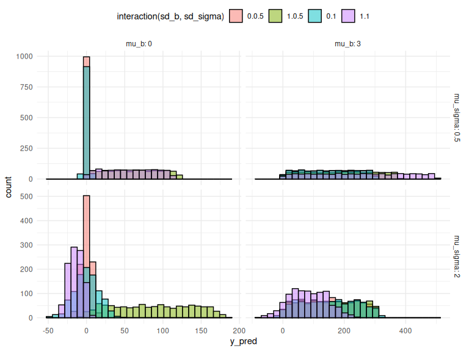
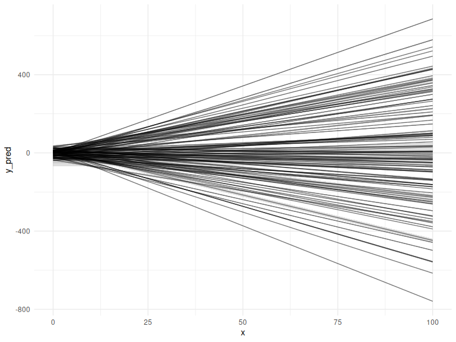
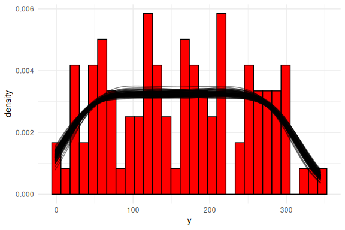
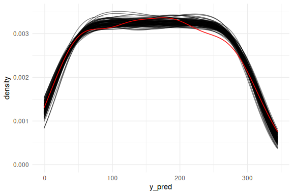
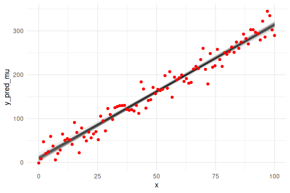
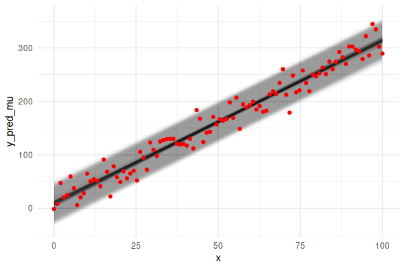
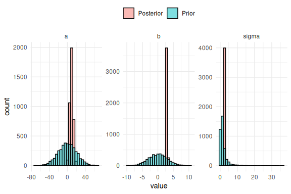

- Bayesian Workflow

This R markdown is for explaining priors in stan.

<!--more-->

## Table of content

- [Overview.](#overview)
- [Fitting a model with priors](#fitting-a-model-with-priors)
- [Posterior predictive checks](#posterior-predictive-checks)
- [Final remarks](#final-remarks)
- [Distributions or transformations?](#distributions-or-transformations)

## Overview.

With more sophisticated models one generally needs to specify priors or
set starting values (or both) for optimization algorithms to perform
well. In the Bayesian framework we can set priors for our parameters and
starting values for our sampler. These are two important aspects of
during analysis with optimization algorithms in general and priors
espeically for Bayesian analysis.

Priors are probability distributions that we put a-priori (before any
data is entered) on our parameters. These probability distributions can
be chosen in several different ways. Here i describe one process of not
only choosing these probability distributions, but also the values of
the parameters of the probability distributions.

We start by using the simulated linear regression from the data
simulation markdown:

``` r
# set the seed for reproduce-ability
seeds = 123

#data points
N = 100
#intercept
a = 10
#slope
b = 3
#sigma
sigma = 20
#x's
x = seq(0,100, length.out = N)
#y's
y = rnorm(N,a+b*x,sigma)
```

Now importantly we can plot it ensuring ourselves that it makes sense

``` r
data.frame() %>% ggplot(aes(x =x,y = y))+geom_point()+theme_classic()
```

<!-- -->

In the “Model fitting to simulated data.Rmd” we wrote a stan model and
ran the model without problems, without any explicit prior
specifications. This is because the “default” prior of stan is a uniform
distribution over the entire real number line
i.e. \]
; \[
for all parameters.

Looking back at the stan model, we have:

``` stan
//This block defines the input that. So these things needs to go into the model
data {
  //Define the number of datapoints this is defined by an integer
  int N;
  //Define a vector called y that is as long as the number of datapoints (i.e. N)
  vector[N] y;
  // same as y but a variable called x our independent variable
  vector[N] x;
}

// This is the parameters block. 
// Here we define the free parameters which are the onces that STAN estimates for us.
// this is again a,b and sigma
parameters {
  real a;
  real b;
  real sigma;
}

// This is the model block here we define the model.

model {
  y ~ normal(a+b*x, sigma);
}
```

There are 3 free parameters of this model a,b and sigma, which we can
and should give prior distributions (priors). For simplicity we are here
only going to work with the normal distribution as the prior and then
transform the values to the specific values we want. This is important
here because we have a parameter
 that
should be contrained to be purely positive, as its the standard
deviation of the normal distribution, we say its constrained to be
positive. The act of using the normal distribution and then transforming
is widely used and with more complex models it is sometimes necessary.

See bottom of this markdown for a brief discussion on transforming
parameter values compared to using explicit distributions that only
support random variables in the given range.

In order to choose the mean and standard deviation of the normal
distributions for each of our parameters it helps to do a similar thing
as was done in the “data simulation” and “Model fitting to simulated
data markdown”. We start by first settling on the two parameters that
governs the mean of our model (the mean of the normal distribution that
links our data (y) to our predictors (x)) i.e. a and b. This mean is
given by
 where
a and b now are random variables coming from the prior with the mean and
standard deviation that we have to choose.

Plotting this for different means and standard deviations results in the
following plot:

``` r
#thresholds
mu_a = seq(0,100,length.out = 2)
sd_a = seq(0,20,length.out = 2)
#slopes
mu_b = seq(0,3,length.out = 2)
sd_b = seq(0,1,length.out = 2)

# number of times to replicate identical rows
rep = c(1:20)

# get the full expansion of the parameter grid
parameters = expand.grid(mu_a = mu_a,
                         sd_a = sd_a,
                         mu_b = mu_b,
                         sd_b = sd_b,
                         rep = rep) %>% mutate(draw = 1:n())


# make a dataframe of the individual thresholds and slopes that are drawn 
# from the means and standard deviations values defined above
df = parameters %>% 
  rowwise() %>% 
  mutate(a = rnorm(n(),mu_a,sd_a),b = rnorm(n(),mu_b,sd_b)) %>% 
# Make a x-variable for each row to plot the results as lines below:
  mutate(x = list(seq(0,100, length.out = 20))) %>% 
  unnest(x)
```

``` r
df %>% mutate(y_pred = a+b*x) %>% 
  mutate(sd_a = as.factor(sd_a), sd_b = as.factor(sd_b), mu_a = as.factor(mu_a), mu_b = as.factor(mu_b)) %>% 
  ggplot(aes(x = x, y = y_pred, group = draw, col = interaction(mu_a,mu_b)))+
  geom_line(alpha = 0.5)+
  facet_grid(sd_a~sd_b, labeller = label_both)+
  theme_minimal()+
  theme(legend.position = "top")
```

<!-- -->

Here I display the mean of the two parameters as colors and their
standard deviations as facets.

Each of these lines represents what could be possible with that given
set of parameter values. So one would choose a set of parameters where
the lines are in regions where one would expect the data to be.

We can also investigate the full model predictions in the same manner as
in the “posterior predictive checks in Model fitting to simulated data
markdown”. For simplicity of the plot below we set a = 0, as this just
changes the threshold, as one can see above and in the “data simulation
markdown”.

``` r
# same as above just now with sigma and slope

mu_sigma = seq(0.5,2,length.out = 2)
sd_sigma = seq(0.5,1,length.out = 2)

parameters = expand.grid(mu_b = mu_b,
                         sd_b = sd_b,
                         mu_sigma = mu_sigma,
                         sd_sigma = sd_sigma) %>% 
  mutate(draw = 1:n())

df = parameters %>% mutate(a = 0,
                           b = rnorm(n(),mu_b,sd_b),
                           sigma = exp(rnorm(n(), mu_sigma, sd_sigma))) # Exponentiated!
```

Please here note the exponential in the sigma parameter. This is the
constrain of the sigma as it has to be strictly positive.

``` r
df  %>% 
  mutate(x = list(seq(0,100, length.out = 1000))) %>% 
  unnest((x)) %>% 
  mutate(y_pred = rnorm(n(),a+b*x,sigma)) %>% 
  mutate(sd_b = as.factor(sd_b),
         mu_b = as.factor(mu_b),
         mu_sigma = as.factor(mu_sigma),
         sd_sigma = as.factor(sd_sigma)) %>% 
  ggplot(aes(x = y_pred, group = draw, fill = interaction(sd_b,sd_sigma)))+
  geom_histogram(alpha = 0.5, col = "black", position = "identity")+
  facet_grid(mu_sigma~mu_b, scales = "free", labeller = label_both)+
  theme_minimal()+
  theme(legend.position = "top")
```

    ## `stat_bin()` using `bins = 30`. Pick better value with `binwidth`.

<!-- -->
Here I display the means of the two parameters b and
 as
facets and the colors of the histograms as the standard deviations.

We might say that based on these plots we decide that our priors should
be:

")

")

 \sim  \mathcal{N}(0, 1)")

Selecting these values is hard and requires plotting what what the
values entail in several different ways. In order to be completely
transparent we might plot the realized lines and their prediction
intervals, the same plot we ended with in the “model fitting to
simulated data markdown”.

``` r
#thresholds
mu_a = 0
sd_a = 20
#slopes
mu_b = 0
sd_b = 3
#sigmas
mu_logsigma = 0
sd_logsigma = 1

# number of lines
rep = c(1:100)

# get the full expansion of the parameter grid
parameters = expand.grid(mu_a = mu_a,
                         sd_a = sd_a,
                         mu_b = mu_b,
                         sd_b = sd_b,
                         mu_logsigma = mu_logsigma,
                         sd_logsigma = sd_logsigma,
                         rep = rep) %>% 
  mutate(draw = 1:n())


# make a dataframe of the individual thresholds and slopes that are drawn 
# from the means and standard deviations values defined above
df = parameters %>% 
  rowwise() %>% 
  mutate(a = rnorm(n(),mu_a,sd_a),
         b = rnorm(n(),mu_b,sd_b),
         sigma = exp(rnorm(n(), mu_logsigma,sd_logsigma))) %>% 
# Make a x-variable for each row to plot the results as lines below:
  mutate(x = list(seq(0,100, length.out = 20))) %>% 
  unnest(x)
```

``` r
df %>% 
  mutate(y_pred = a+b*x,
         y_pred_low = a+b*x - 2 * sigma,
         y_pred_high = a+b*x + 2 * sigma) %>%  
  ggplot()+
  # the prediction ribbon:
  geom_ribbon(aes(x = x, ymin = y_pred_low, ymax = y_pred_high, group = draw), fill = "grey", alpha = 0.5)+
  geom_line(aes(x = x, y = y_pred, group = draw), col = "black", alpha = 0.5)+
  theme_minimal()+
  theme(legend.position = "top")
```

<!-- -->

## Fitting a model with priors

Now we take a step back and look at the stan code for the model again
and enter the priors we decided upon above.

``` stan
//This block defines the input that. So these things needs to go into the model
data {
  //Define the number of datapoints this is defined by an integer
  int N;
  //Define a vector called y that is as long as the number of datapoints (i.e. N)
  vector[N] y;
  // same as y but a variable called x our independent variable
  vector[N] x;
}

// This is the parameters block. 
// Here we define the free parameters which are the onces that STAN estimates for us.
// this is again a,b and sigma
parameters {
  real a;
  real b;
  real sigma;
}

// This is the model block here we define the model.

model {
  //priors for the model
  a ~ normal(0,20);
  b ~ normal(0,3);
  sigma ~ normal(0,1);
  
  //Note that sigma is exponentiated to keep it positive now.
  
  y ~ normal(a+b*x, exp(sigma));
}
```

Here the priors have now been added to the model statement block,
exactly as written above in the mathematical statement.

Now running the model.

``` r
fit = model_obj2$sample(data = list(N =N, x = x, y =y), seed = seeds)
```

    ## Running MCMC with 4 sequential chains...
    ## 
    ## Chain 1 Iteration:    1 / 2000 [  0%]  (Warmup) 
    ## Chain 1 Iteration:  100 / 2000 [  5%]  (Warmup) 
    ## Chain 1 Iteration:  200 / 2000 [ 10%]  (Warmup) 
    ## Chain 1 Iteration:  300 / 2000 [ 15%]  (Warmup) 
    ## Chain 1 Iteration:  400 / 2000 [ 20%]  (Warmup) 
    ## Chain 1 Iteration:  500 / 2000 [ 25%]  (Warmup) 
    ## Chain 1 Iteration:  600 / 2000 [ 30%]  (Warmup) 
    ## Chain 1 Iteration:  700 / 2000 [ 35%]  (Warmup) 
    ## Chain 1 Iteration:  800 / 2000 [ 40%]  (Warmup) 
    ## Chain 1 Iteration:  900 / 2000 [ 45%]  (Warmup) 
    ## Chain 1 Iteration: 1000 / 2000 [ 50%]  (Warmup) 
    ## Chain 1 Iteration: 1001 / 2000 [ 50%]  (Sampling) 
    ## Chain 1 Iteration: 1100 / 2000 [ 55%]  (Sampling) 
    ## Chain 1 Iteration: 1200 / 2000 [ 60%]  (Sampling) 
    ## Chain 1 Iteration: 1300 / 2000 [ 65%]  (Sampling) 
    ## Chain 1 Iteration: 1400 / 2000 [ 70%]  (Sampling) 
    ## Chain 1 Iteration: 1500 / 2000 [ 75%]  (Sampling) 
    ## Chain 1 Iteration: 1600 / 2000 [ 80%]  (Sampling) 
    ## Chain 1 Iteration: 1700 / 2000 [ 85%]  (Sampling) 
    ## Chain 1 Iteration: 1800 / 2000 [ 90%]  (Sampling) 
    ## Chain 1 Iteration: 1900 / 2000 [ 95%]  (Sampling) 
    ## Chain 1 Iteration: 2000 / 2000 [100%]  (Sampling) 
    ## Chain 1 finished in 0.1 seconds.
    ## Chain 2 Iteration:    1 / 2000 [  0%]  (Warmup) 
    ## Chain 2 Iteration:  100 / 2000 [  5%]  (Warmup) 
    ## Chain 2 Iteration:  200 / 2000 [ 10%]  (Warmup) 
    ## Chain 2 Iteration:  300 / 2000 [ 15%]  (Warmup) 
    ## Chain 2 Iteration:  400 / 2000 [ 20%]  (Warmup) 
    ## Chain 2 Iteration:  500 / 2000 [ 25%]  (Warmup) 
    ## Chain 2 Iteration:  600 / 2000 [ 30%]  (Warmup) 
    ## Chain 2 Iteration:  700 / 2000 [ 35%]  (Warmup) 
    ## Chain 2 Iteration:  800 / 2000 [ 40%]  (Warmup) 
    ## Chain 2 Iteration:  900 / 2000 [ 45%]  (Warmup) 
    ## Chain 2 Iteration: 1000 / 2000 [ 50%]  (Warmup) 
    ## Chain 2 Iteration: 1001 / 2000 [ 50%]  (Sampling) 
    ## Chain 2 Iteration: 1100 / 2000 [ 55%]  (Sampling) 
    ## Chain 2 Iteration: 1200 / 2000 [ 60%]  (Sampling) 
    ## Chain 2 Iteration: 1300 / 2000 [ 65%]  (Sampling) 
    ## Chain 2 Iteration: 1400 / 2000 [ 70%]  (Sampling) 
    ## Chain 2 Iteration: 1500 / 2000 [ 75%]  (Sampling) 
    ## Chain 2 Iteration: 1600 / 2000 [ 80%]  (Sampling) 
    ## Chain 2 Iteration: 1700 / 2000 [ 85%]  (Sampling) 
    ## Chain 2 Iteration: 1800 / 2000 [ 90%]  (Sampling) 
    ## Chain 2 Iteration: 1900 / 2000 [ 95%]  (Sampling) 
    ## Chain 2 Iteration: 2000 / 2000 [100%]  (Sampling) 
    ## Chain 2 finished in 0.1 seconds.
    ## Chain 3 Iteration:    1 / 2000 [  0%]  (Warmup) 
    ## Chain 3 Iteration:  100 / 2000 [  5%]  (Warmup) 
    ## Chain 3 Iteration:  200 / 2000 [ 10%]  (Warmup) 
    ## Chain 3 Iteration:  300 / 2000 [ 15%]  (Warmup) 
    ## Chain 3 Iteration:  400 / 2000 [ 20%]  (Warmup) 
    ## Chain 3 Iteration:  500 / 2000 [ 25%]  (Warmup) 
    ## Chain 3 Iteration:  600 / 2000 [ 30%]  (Warmup) 
    ## Chain 3 Iteration:  700 / 2000 [ 35%]  (Warmup) 
    ## Chain 3 Iteration:  800 / 2000 [ 40%]  (Warmup) 
    ## Chain 3 Iteration:  900 / 2000 [ 45%]  (Warmup) 
    ## Chain 3 Iteration: 1000 / 2000 [ 50%]  (Warmup) 
    ## Chain 3 Iteration: 1001 / 2000 [ 50%]  (Sampling) 
    ## Chain 3 Iteration: 1100 / 2000 [ 55%]  (Sampling) 
    ## Chain 3 Iteration: 1200 / 2000 [ 60%]  (Sampling) 
    ## Chain 3 Iteration: 1300 / 2000 [ 65%]  (Sampling) 
    ## Chain 3 Iteration: 1400 / 2000 [ 70%]  (Sampling) 
    ## Chain 3 Iteration: 1500 / 2000 [ 75%]  (Sampling) 
    ## Chain 3 Iteration: 1600 / 2000 [ 80%]  (Sampling) 
    ## Chain 3 Iteration: 1700 / 2000 [ 85%]  (Sampling) 
    ## Chain 3 Iteration: 1800 / 2000 [ 90%]  (Sampling) 
    ## Chain 3 Iteration: 1900 / 2000 [ 95%]  (Sampling) 
    ## Chain 3 Iteration: 2000 / 2000 [100%]  (Sampling) 
    ## Chain 3 finished in 0.1 seconds.
    ## Chain 4 Iteration:    1 / 2000 [  0%]  (Warmup) 
    ## Chain 4 Iteration:  100 / 2000 [  5%]  (Warmup) 
    ## Chain 4 Iteration:  200 / 2000 [ 10%]  (Warmup) 
    ## Chain 4 Iteration:  300 / 2000 [ 15%]  (Warmup) 
    ## Chain 4 Iteration:  400 / 2000 [ 20%]  (Warmup) 
    ## Chain 4 Iteration:  500 / 2000 [ 25%]  (Warmup) 
    ## Chain 4 Iteration:  600 / 2000 [ 30%]  (Warmup) 
    ## Chain 4 Iteration:  700 / 2000 [ 35%]  (Warmup) 
    ## Chain 4 Iteration:  800 / 2000 [ 40%]  (Warmup) 
    ## Chain 4 Iteration:  900 / 2000 [ 45%]  (Warmup) 
    ## Chain 4 Iteration: 1000 / 2000 [ 50%]  (Warmup) 
    ## Chain 4 Iteration: 1001 / 2000 [ 50%]  (Sampling) 
    ## Chain 4 Iteration: 1100 / 2000 [ 55%]  (Sampling) 
    ## Chain 4 Iteration: 1200 / 2000 [ 60%]  (Sampling) 
    ## Chain 4 Iteration: 1300 / 2000 [ 65%]  (Sampling) 
    ## Chain 4 Iteration: 1400 / 2000 [ 70%]  (Sampling) 
    ## Chain 4 Iteration: 1500 / 2000 [ 75%]  (Sampling) 
    ## Chain 4 Iteration: 1600 / 2000 [ 80%]  (Sampling) 
    ## Chain 4 Iteration: 1700 / 2000 [ 85%]  (Sampling) 
    ## Chain 4 Iteration: 1800 / 2000 [ 90%]  (Sampling) 
    ## Chain 4 Iteration: 1900 / 2000 [ 95%]  (Sampling) 
    ## Chain 4 Iteration: 2000 / 2000 [100%]  (Sampling) 
    ## Chain 4 finished in 0.1 seconds.
    ## 
    ## All 4 chains finished successfully.
    ## Mean chain execution time: 0.1 seconds.
    ## Total execution time: 0.7 seconds.

One can then do the same steps as in the “Model fitting to simulated
data markdown” and plot the posterior predictive checks:

## Posterior predictive checks

``` r
n_draws_plot = 100

draw_id = sample(1:4000,n_draws_plot)

as_draws_df(fit$draws(c("a","b","sigma"))) %>% 
  select(-contains(".")) %>% mutate(draw = 1:n(),
                                    x = list(seq(0,100, length.out = N))) %>% 
  filter(draw %in% draw_id) %>% 
  unnest((x)) %>% 
  mutate(y_pred = rnorm(n(),a+b*x,sigma)) %>% 
  ggplot()+
  geom_histogram(data = data.frame(y = y),aes(x = y, after_stat(density)),col = "black", fill = "red")+
  geom_line(aes(x = y_pred, group = draw), col = "black", alpha = 0.5, stat = "density")+
  theme_minimal()
```

    ## Warning: Dropping 'draws_df' class as required metadata was removed.

    ## `stat_bin()` using `bins = 30`. Pick better value with `binwidth`.

<!-- -->

Or as densities:

``` r
as_draws_df(fit$draws(c("a","b","sigma"))) %>% 
  select(-contains(".")) %>% mutate(draw = 1:n(),
                                    x = list(seq(0,100, length.out = N))) %>% 
  filter(draw %in% draw_id) %>% 
  unnest((x)) %>% 
  mutate(y_pred = rnorm(n(),a+b*x,sigma)) %>% 
  ggplot()+
  geom_line(aes(x = y_pred, group = draw), col = "black", alpha = 0.5, stat = "density")+
  geom_density(data = data.frame(y = y),aes(x = y, after_stat(density)), col = "red")+
  theme_minimal()
```

    ## Warning: Dropping 'draws_df' class as required metadata was removed.

<!-- -->

Overlaying the mean predictions on the data.

``` r
as_draws_df(fit$draws(c("a","b","sigma"))) %>% 
  select(-contains(".")) %>% mutate(draw = 1:n(),
                                    x = list(seq(0,100, length.out = N))) %>% 
  unnest((x)) %>% 
  filter(draw %in% draw_id) %>% 
  mutate(y_pred_mu = a+b*x) %>% 
  ggplot()+
  geom_line(aes(x = x, y = y_pred_mu, group = draw), col = "black", alpha = 0.05)+
  geom_point(data = data.frame(y = y,x=x),aes(x = x, y = y), col = "red")+
  theme_minimal()
```

    ## Warning: Dropping 'draws_df' class as required metadata was removed.

<!-- -->

We can also overlay the 95 % prediction interval, by including sigma.

``` r
# same as above now we just do not get our predictions from a normal distribution,
# but instead we just plot the mean prediction "a+b*x" as a line plot.

as_draws_df(fit$draws(c("a","b","sigma"))) %>% 
  select(-contains(".")) %>% mutate(draw = 1:n(),
                                    x = list(seq(0,100, length.out = N))) %>% 
  unnest((x)) %>% 
  filter(draw %in% draw_id) %>% 
  # Adding two extra terms for the prediction intervals (here we use 2 instead of 1.96 for 95%)
  # Note again the exponentiation!
  mutate(y_pred_mu = a+b*x,
         y_pred_low = a+b*x - 2 * exp(sigma),
         y_pred_high = a+b*x + 2 * exp(sigma)
         ) %>% 
  ggplot()+
  # the prediction ribbon:
  geom_ribbon(aes(x = x, ymin = y_pred_low, ymax = y_pred_high, group = draw), fill = "grey", alpha = 0.005)+
  geom_line(aes(x = x, y = y_pred_mu, group = draw), col = "black", alpha = 0.05)+
  geom_point(data = data.frame(y = y,x=x),aes(x = x, y = y), col = "red")+
  theme_minimal()
```

    ## Warning: Dropping 'draws_df' class as required metadata was removed.

<!-- -->

So we see again that the model fits the data nicely, but we haven’t
looked at the marginal posterior parameter estimates (the histograms of
the individual parameters). This is because we can now not only plot the
posterior parameter estimates, but also overlay what the prior for these
parameters were. This plot is known as prior-posterior updates and
essentially tells us something about how much the model learns about the
parameters after seeing the data.

``` r
rbind(
  as_draws_df(fit$draws(c("a","b","sigma"))) %>% 
    select(-contains(".")) %>% pivot_longer(everything()) %>% 
    mutate(pp = "Posterior"),
  data.frame(name = rep(c("a","b","sigma"), each = 4000),
             value = c(rnorm(4000,0,20),rnorm(4000,0,3),exp(rnorm(4000,0,1)))) %>% 
    mutate(pp = "Prior")
  ) %>% 
  ggplot(aes(x = value, fill = pp))+
  geom_histogram(col = "black", position = "identity", alpha = 0.5)+
  facet_wrap(~name, scales = "free")+
  theme_minimal()+
  theme(legend.position = "top",
        legend.title = element_blank())
```

    ## Warning: Dropping 'draws_df' class as required metadata was removed.

    ## `stat_bin()` using `bins = 30`. Pick better value with `binwidth`.

<!-- -->

The difference between the prior and posterior distribution of the
parameters is thus what is learned about the parameter after “seeing”
the data. Here we see that the models “learns” alot from seeing the data
as all the posterior (red histograms) are a lot more narrow than the
priors (blue histograms). What is seen for all the parameters are
essentially what one wants to see, that the posterior is inside the
prior distribution and much narrower.

## Final remarks

This finishes the section on priors using the simple linear regression.

The main takeaway from this markdown should be that the choosing priors
is difficult and thus should be visualized and understood through prior
predictive checks. This is identical to the idea of checking how well
the model fits the data posterior predictive checks, one is just before
the model actually “sees” the data. Furthermore, this markdown showed
how one can investigate how much is learned about the parameters of the
model by plotting the prior and posterior marginal distribution of each
parameter.

## Distributions or transformations?

In this markdown the

parameter had to be exponentially transformed because I decided to
sample all parameters from a normal distribution. One could instead of
using the normal distribution and then transforming the parameter
instead using a distribution that only supports positive random
variables, such as the lognormal, gamma or truncated normal
distribution. The choice of using distribution that only support random
variables on the scale wanted or using a normal distribution with
transformations is not to my knowledge well defined. I choose to most
often sample from a normal distribution and then do transformations as
this is convenient especially for more complex models, such as
hierarchical implementations.

Please note the markdown (5.z Distributions) here I go into some of
these considerations and demonstrate some of the native distributions in
Stan.
