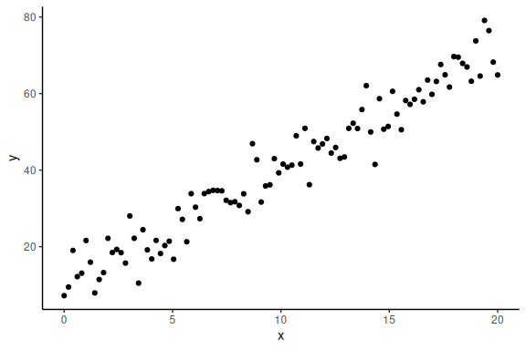
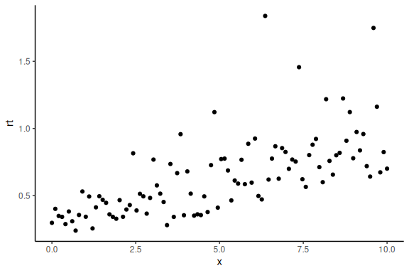
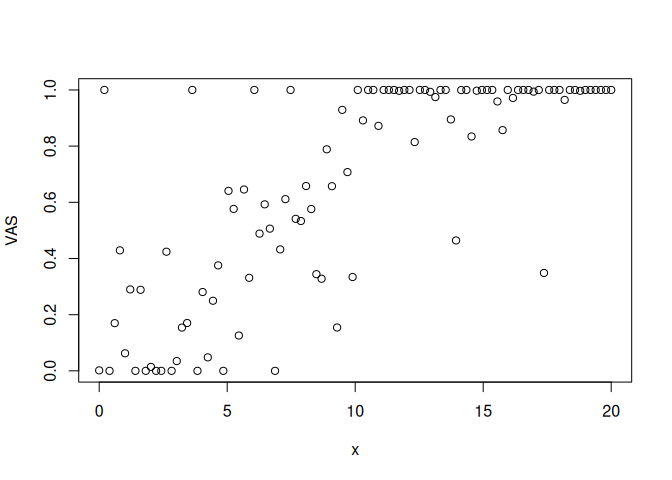
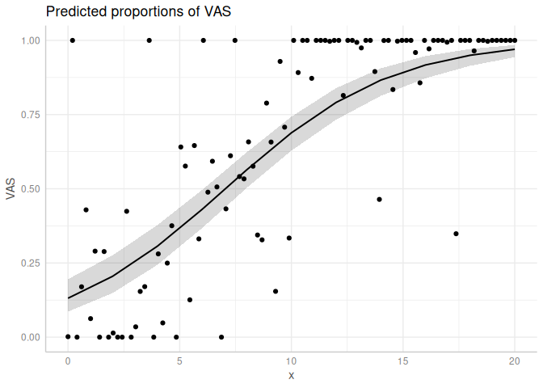
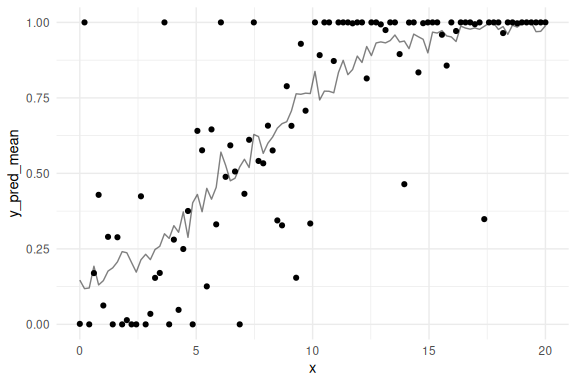
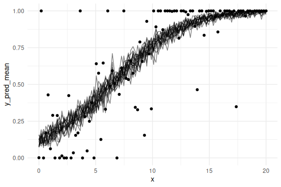

---
categories:
  - Starting Off
excerpt_separator: <!--more-->
---

- Bayesian Workflow

The following markdown is an insight into how i think about distributions and the use of these in
statistical and computational modeling.


<!--more-->

## Table of content


- [Overview](#overview)
- [Meeting constraints with
  transformations.](#meeting-constraints-with-transformations)
- [Meeting constraints with
  distributions.](#meeting-constraints-with-distributions)
- [Distributions or transformations?](#distributions-or-transformations)
- [Expections.](#expections)
- [Ordered beta distribution](#ordered-beta-distribution)
- [Simulation](#simulation)
- [Fitting the ordered beta in
  glmmtmb](#fitting-the-ordered-beta-in-glmmtmb)
- [Fitting the ordered beta in STAN:](#fitting-the-ordered-beta-in-stan)
- [Shiny app](#shiny-app)
- [Final remarks](#final-remarks)

## Overview

Note that my beliefs and intuitions here are most definitely wrong,
especially from a rigorous definition stand-point, but i believe they
might be useful from a practical point of view.

When doing statistical analyses especially when using (g)lm(er)
(generalized linear mixed effects models) we are always troubled by
having to specify a family (at least for the generalized case). These
are essentially what i call likelihood functions as they are the maths
that connect our parameters to our data. To make this tangible lets
start with a frequentist model using the data from the linear model
addressed in now many of the markdowns

As a refresher here is the “model”

")

Here  is our
outcome of interest and
 is our
independent variable.

The other symbols i.e. a,b and
 are
free parameters.

The last symbol

specifies the distribution or likelihood functions, here the normal
distribution.

To simulate data from this model we choose values for our parameters and
select a range of x-values that would make sense for the experimental
design (levels of the independent variable you have in the experiment).

``` r
#data points
N = 100
#intercept
a = 10
#slope
b = 3
#sigma
sigma = 5
#x's
x = seq(0,20, length.out = N)
```

Now to simulate data we use the distributions build into R.

In the above we specified that the normal distribution so we use the
random number generator of the normal distribution to get responses
.

``` r
# generate y-values from our model and parameters
y = rnorm(N,a+b*x,sigma)
```

Now importantly we can plot it ensuring ourselves that it makes sense

``` r
data.frame() %>% ggplot(aes(x =x,y = y))+geom_point()+theme_classic()
```

<!-- -->

The main thing to note here is that we choose a specific probability
density function to simulate these data, i.e., the normal distribution.

This is sometimes called the error distribution as it essentially
specifies the errors of the model. Thus when we write the following
model (a+b\*x) we assume that this error distribution is normal, this is
implicit in all lm(er) models. like:

``` r
m1 = lm(y~x)
summary(m1)
```

    ## 
    ## Call:
    ## lm(formula = y ~ x)
    ## 
    ## Residuals:
    ##      Min       1Q   Median       3Q      Max 
    ## -12.2678  -2.7618  -0.1731   3.2425  10.4744 
    ## 
    ## Coefficients:
    ##             Estimate Std. Error t value Pr(>|t|)    
    ## (Intercept)  9.83054    0.90772   10.83   <2e-16 ***
    ## x            3.06215    0.07841   39.05   <2e-16 ***
    ## ---
    ## Signif. codes:  0 '***' 0.001 '**' 0.01 '*' 0.05 '.' 0.1 ' ' 1
    ## 
    ## Residual standard error: 4.573 on 98 degrees of freedom
    ## Multiple R-squared:  0.9396, Adjusted R-squared:  0.939 
    ## F-statistic:  1525 on 1 and 98 DF,  p-value: < 2.2e-16

That we assume that the error distribution is normal, tells the model
that all values are “possible” (not equally probable tho), as the normal
distribution can generate values from
 to
, but
also that the error on both sides of the mean are symmetrical.

Now the main thing we have to care about from a practical modeling
standpoint is that the model in use, can actually generate the values
seen in the data we will collect and does not generate “impossible”
data-points.

Imagine having collected response time data, and wanting to model the
mean of these response times.

Modeling them using a normal distribution would on the forefront be a
poor choice, as we know that response times cannot be negative. Thus,
having a distribution that allows for negative values is nonsensical
from the start.

In practice using a normal distribution for responses times can be more
or less bad. For instance, if a lot of precise measurement are
collected, the fitted model might in the end, not with reasonable
probability, predict negative values. However i would argue that this is
seldom the case, and from the start one has to argue for which
distribution is used and the normal distribution would be hard to argue
for, other that its the most widely used …

The analysis of response times is troublesome because we have knowledge
about constraints of the data and we want to use these constraints.
There are two main ways of meeting such constraints, transformations or
distributions.

## Meeting constraints with transformations.

In much of cognitive science it has become common when analyzing
response times to meet the non-negative constraint by modeling the
logarithm of the response time, instead of the response time themselves.
This transformation turns the strictly positive distribution of response
times into something that, looks normally distributed (atleast often)
that can take on negative values (the logarithm of values below 1 and
above 0 become negative).

One can demonstrate this in the following way:

we use similar parameters as above but we now assume that we are
simulating log(RT) (y-values).

``` r
#data points
N = 100
#intercept
a = -1
#slope
b = 0.1
#sigma
sigma = 0.3
#x's
x = seq(0,10, length.out = N)
```

``` r
# generate y-values from our model and parameters (these are our log(RT))
logrt = rnorm(N,a+b*x,sigma)
rt = exp(logrt)
```

Now importantly we can plot it ensuring ourselves that it still makes
sense (here we plot the exponential of the log of the response times)

``` r
data.frame() %>% 
  ggplot(aes(x =x,y = rt))+
  geom_point()+
  theme_classic()
```

<!-- -->

One can of cause also fit a linear model again now on the log(RT).

``` r
m1 = lm(log(rt)~x)
summary(m1)
```

    ## 
    ## Call:
    ## lm(formula = log(rt) ~ x)
    ## 
    ## Residuals:
    ##      Min       1Q   Median       3Q      Max 
    ## -0.56882 -0.20064 -0.02321  0.16824  0.99161 
    ## 
    ## Coefficients:
    ##              Estimate Std. Error t value Pr(>|t|)    
    ## (Intercept) -1.079823   0.057612  -18.74   <2e-16 ***
    ## x            0.109512   0.009954   11.00   <2e-16 ***
    ## ---
    ## Signif. codes:  0 '***' 0.001 '**' 0.01 '*' 0.05 '.' 0.1 ' ' 1
    ## 
    ## Residual standard error: 0.2902 on 98 degrees of freedom
    ## Multiple R-squared:  0.5526, Adjusted R-squared:  0.548 
    ## F-statistic:   121 on 1 and 98 DF,  p-value: < 2.2e-16

## Meeting constraints with distributions.

Another approach to meet constraints on values the data can take on, is
to use distributions that fit with the constraints. This entails not
transforming the dependent variable as above, but instead using a
distribution that can only produce values that are consistent with the
un-transformed dependent variable.

For the case of response times and other variables that are non-negative
a lot of specific distributions are applicable, lognormal, gamma, skew
normal [etc](https://lindeloev.github.io/shiny-rt/). One can fit a
lognormal distribution in the following way:

``` r
m3 = gamlss::gamlss(rt~x, family = LOGNO(mu.link = "identity", sigma.link = "log"))
```

    ## GAMLSS-RS iteration 1: Global Deviance = -72.1064 
    ## GAMLSS-RS iteration 2: Global Deviance = -72.1064

``` r
summary(m3)
```

    ## ******************************************************************
    ## Family:  c("LOGNO", "Log Normal") 
    ## 
    ## Call:  gamlss::gamlss(formula = rt ~ x, family = LOGNO(mu.link = "identity",  
    ##     sigma.link = "log")) 
    ## 
    ## Fitting method: RS() 
    ## 
    ## ------------------------------------------------------------------
    ## Mu link function:  identity
    ## Mu Coefficients:
    ##              Estimate Std. Error t value Pr(>|t|)    
    ## (Intercept) -1.079823   0.057033  -18.93   <2e-16 ***
    ## x            0.109512   0.009854   11.11   <2e-16 ***
    ## ---
    ## Signif. codes:  0 '***' 0.001 '**' 0.01 '*' 0.05 '.' 0.1 ' ' 1
    ## 
    ## ------------------------------------------------------------------
    ## Sigma link function:  log
    ## Sigma Coefficients:
    ##             Estimate Std. Error t value Pr(>|t|)    
    ## (Intercept) -1.24721    0.07071  -17.64   <2e-16 ***
    ## ---
    ## Signif. codes:  0 '***' 0.001 '**' 0.01 '*' 0.05 '.' 0.1 ' ' 1
    ## 
    ## ------------------------------------------------------------------
    ## No. of observations in the fit:  100 
    ## Degrees of Freedom for the fit:  3
    ##       Residual Deg. of Freedom:  97 
    ##                       at cycle:  2 
    ##  
    ## Global Deviance:     -72.10636 
    ##             AIC:     -66.10636 
    ##             SBC:     -58.29084 
    ## ******************************************************************

Before discussing what one should and should not do I will briefly show
how the second examples can be implemented in stan, as the first is
identical but with giving stan logRT instead of RT as the response time
data.

``` stan
//This block defines the input that. So these things needs to go into the model
data {
  //Define the number of datapoints this is defined by an integer
  int N;
  //Define a vector called y that is as long as the number of datapoints (i.e. N)
  vector[N] y;
  // same as y but a variable called x our independent variable
  vector[N] x;
}

// This is the parameters block. 
// Here we define the free parameters which are the onces that STAN estimates for us.
// this is again a,b and sigma
parameters {
  real a;
  real b;
  real sigma;
}

// This is the model block here we define the model

model {
  //likelihood / distribution
  y ~ lognormal(a+b*x, sigma);
}
```

As can be seen the only difference in the stan model, is in the last
section of the model block where the distribution that connects our
parameters / model to our data. Here I have specified “lognormal”
instead of normal.

People are refereed to the [Stan
website](https://mc-stan.org/docs/functions-reference/unbounded_continuous_distributions.html)
for a list of distributions that are already implemented in the
language.

## Distributions or transformations?

So what should one do? Transform the dependent variable and model the
transformed variable or model the dependent variable in the original
scale with a distribution that makes sense for the constraints?

Personally i do not know and i do not think there is a straight forward
answer. What I tend to do is use distributions for the likelihood
(i.e. the lognormal distribution for response times) but transformations
to keep parameters in their respective ranges.

A couple of extras:

For parameters that are bounded on both a lower and upper end (without
inclusion of the lower and upper ends) the transformation is the inverse
logit transformation (can be found as brms::inv_logit_scaled() in R and
inv_logit() in Stan).

The distribution commonly used for variables with two bounds is the beta
distribution which produces values between 0 and 1 (but importantly not
0 and 1).

## Expections.

The exception to the above discussion is when no single transformations
can be done to a unbounded variable, to get it to the range of
measurements (the collected dependent variable).

One example of this is the ordered beta distribution (or the shifted
lognormal distribution). These distribution include another parameters
that essentially changes the bounds of the dependent variable. For the
ordered beta, one can now get extreme values (i.e 0 and 1’s and all
values between) and for the shifted lognormal one can now only get
positive values above a certain value (the shift).

These types of uncommon / custom distributions are very powerful and are
easily avaliable in stan (some also in frequentists packages,
i.e. glmmtmb for the ordered beta distribution).

All credits for the ordered beta distribution / model goes to [Robert
Kuberinec](https://cran.r-project.org/web/packages/ordbetareg/vignettes/package_introduction.html).

Below i show how we can simulate data from the ordered beta distribution
and fit models using it both in stan and in glmmtmb.

## Ordered beta distribution

Firstly the ordered beta distribution essentially contains 4 main
parameters, a mean, a precision and two cutpoints. The distribution
essentially captures the dependency between the mean and the proportion
of 0 and 1’s by including two cutpoints.

This means as the mean of the prediction increases so does the
proportion of 1 responses, which is quite a nice property for something
like VAS-ratings.

## Simulation

Because the function for the random number generator is quite long (and
note native to R) I have stored it in the utility directory. All the
code for these functions are openly avaliable on [kuberinecs github
page](https://github.com/saudiwin/ordbetareg_pack/tree/master).

Please note that in the below simulation the 2nd, 3rd and 4th argument.
The second argument we use the inv_logit transformation to keep the mean
of the beta distribution between 0 and 1 (as our parameters are not
constrained). For the 3rd argument we have put sigma to 5; Note that
sigma is here a precision parameter and not a spread parameter (no
exponentiation as we choose a positive value). This means that instead
of describing the spread (as in the normal distribution) it describes
the inverse of the spread i.e., the precision of the datapoints. Lastly
the fourth argument holds the cutpoints, these essentially help
determine how many 0’s and 1’s are going to be produced together with
the mean.

``` r
source(here::here("stan","Utility","ordered beta.R"))
#data points
N = 100
#intercept
a = -2
#slope
b = 0.3
#sigma
sigma = 5
#x's
x = seq(0,20, length.out = N)
VAS = rordbeta(N,brms::inv_logit_scaled(a+b*x),sigma, cutpoints = c(-2,2))

plot(x,VAS)
```

<!-- -->

we see that we obtain 0 and 1 responses as well as responses between 0
and 1. Exactly what we expect from an experiment with VAS-ratings.

## Fitting the ordered beta in glmmtmb

This distribution is only implemented in glmmTMB and in stan.

here is the glmmTMB implementation:

``` r
m4 = glmmTMB::glmmTMB(VAS~x, family = ordbeta(link = "logit"))
```

    ## Warning in glmmTMB::glmmTMB(VAS ~ x, family = ordbeta(link = "logit")): use of
    ## the 'data' argument is recommended

``` r
# The mean coefficient estimate

summary(m4)
```

    ##  Family: ordbeta  ( logit )
    ## Formula:          VAS ~ x
    ## 
    ##      AIC      BIC   logLik deviance df.resid 
    ##     68.3     81.4    -29.2     58.3       95 
    ## 
    ## 
    ## Dispersion parameter for ordbeta family (): 3.98 
    ## 
    ## Conditional model:
    ##             Estimate Std. Error z value Pr(>|z|)    
    ## (Intercept) -1.89024    0.24184  -7.816 5.45e-15 ***
    ## x            0.26838    0.02617  10.255  < 2e-16 ***
    ## ---
    ## Signif. codes:  0 '***' 0.001 '**' 0.01 '*' 0.05 '.' 0.1 ' ' 1

``` r
# The precision estimate
print(paste0("sigma = ", round(sigma(m4),2)))
```

    ## [1] "sigma = 3.98"

``` r
# The cut point estimates:
m4$fit$parfull[4:5]
```

    ##       psi       psi 
    ## -2.335841  1.765437

We can also look at the marginal effects:

``` r
plot(ggpredict(m4))+
  geom_point(data = data.frame(x = x, VAS= VAS), aes(x = x, y = VAS))
```

<!-- -->

## Fitting the ordered beta in STAN:

Below is the stan code to fit the same model as Glmmtmb

``` stan
functions{
  
  real ord_beta_reg_lpdf(real y, real mu, real phi, real cutzero, real cutone) {

    vector[2] thresh;
    thresh[1] = cutzero;
    thresh[2] = cutzero + exp(cutone);

  if(y==0) {
      return log1m_inv_logit(mu - thresh[1]);
    } else if(y==1) {
      return log_inv_logit(mu  - thresh[2]);
    } else {
      return log_diff_exp(log_inv_logit(mu   - thresh[1]), log_inv_logit(mu - thresh[2])) +
                beta_lpdf(y|exp(log_inv_logit(mu) + log(phi)),exp(log1m_inv_logit(mu) + log(phi)));
    }
  }
  
  real induced_dirichlet_lpdf(real nocut, vector alpha, real phi, int cutnum, real cut1, real cut2) {
    int K = num_elements(alpha);
    vector[K-1] c = [cut1, cut1 + exp(cut2)]';
    vector[K - 1] sigma = inv_logit(phi - c);
    vector[K] p;
    matrix[K, K] J = rep_matrix(0, K, K);

    if(cutnum==1) {

    // Induced ordinal probabilities
    p[1] = 1 - sigma[1];
    for (k in 2:(K - 1))
      p[k] = sigma[k - 1] - sigma[k];
    p[K] = sigma[K - 1];

    // Baseline column of Jacobian
    for (k in 1:K) J[k, 1] = 1;

    // Diagonal entries of Jacobian
    for (k in 2:K) {
      real rho = sigma[k - 1] * (1 - sigma[k - 1]);
      J[k, k] = - rho;
      J[k - 1, k] = rho;
    }

    // divide in half for the two cutpoints

    // don't forget the ordered transformation

      return   dirichlet_lpdf(p | alpha)
           + log_determinant(J) + cut2;
    } else {
      return(0);
    }
  }
}

//This block defines the input that. So these things needs to go into the model
data {
  //Define the number of datapoints this is defined by an integer
  int N;
  //Define a vector called y that is as long as the number of datapoints (i.e. N)
  vector[N] y;
  // same as y but a variable called x our independent variable
  vector[N] x;
}

// This is the parameters block. 
// Here we define the free parameters which are the onces that STAN estimates for us.
// this is again a,b and sigma
parameters {
  real a;
  real b;
  real prec;
  real cutzero;
  real cutone;
}

// This is the model block here we define the model.

model {
    target += induced_dirichlet_lpdf(cutzero | [1,1,1]', 0, 1,cutzero,cutone);
    target += induced_dirichlet_lpdf(cutone | [1,1,1]', 0, 2,cutzero,cutone);

  for(n in 1:N){
    //likelihood
    target  += ord_beta_reg_lpdf(y[n] | a+b*x[n], exp(prec),cutzero,cutone);
  }
}
```

Using such a custom made likelihood function includes another “block” in
STAN code i.e., the “function” block.

Here two new functions are defined “ord_beta_reg_lpdf” and
“induced_dirichlet_lpdf”. The former is the likelihood function and the
latter a helper function for the priors on the cutpoints. This latter
function to define the priors on the cutpoints iis not strictly
necessary for many models, but it helps. What this function essentially
does together with the two priors defined in the model block for the
cutpoints i.e.,

” target += induced_dirichlet_lpdf(cutzero \| \[1,1,1\]‘, 0,
1,cutzero,cutone); target += induced_dirichlet_lpdf(cutone \|
\[1,1,1\]’, 0, 2,cutzero,cutone); ”

Is that it ensures that the lower cutpoint is always lower than the
upper cutpoint.

Lets fit the model!

``` r
# Fit the STAN model
fit = model_obj2$sample(data = list(N =N, x = x, y =VAS),
                        seed = seeds,
                        #warm-up samples
                        iter_warmup = 500,
                        #inference samples
                        iter_sampling = 500,
                        #chains
                        chains = 4,
                        #parallel chains
                        parallel_chains = 4,
                        #refresh rate of printing
                        refresh = 250,
                        #adap delta argument default 0.9
                        adapt_delta = 0.9)
```

    ## Running MCMC with 4 parallel chains...
    ## 
    ## Chain 1 Iteration:   1 / 1000 [  0%]  (Warmup)

    ## Chain 2 Iteration:   1 / 1000 [  0%]  (Warmup)

    ## Chain 3 Iteration:   1 / 1000 [  0%]  (Warmup)

    ## Chain 4 Iteration:   1 / 1000 [  0%]  (Warmup)

    ## Chain 1 Iteration: 250 / 1000 [ 25%]  (Warmup) 
    ## Chain 2 Iteration: 250 / 1000 [ 25%]  (Warmup) 
    ## Chain 3 Iteration: 250 / 1000 [ 25%]  (Warmup) 
    ## Chain 4 Iteration: 250 / 1000 [ 25%]  (Warmup) 
    ## Chain 1 Iteration: 500 / 1000 [ 50%]  (Warmup) 
    ## Chain 1 Iteration: 501 / 1000 [ 50%]  (Sampling) 
    ## Chain 2 Iteration: 500 / 1000 [ 50%]  (Warmup) 
    ## Chain 2 Iteration: 501 / 1000 [ 50%]  (Sampling) 
    ## Chain 3 Iteration: 500 / 1000 [ 50%]  (Warmup) 
    ## Chain 3 Iteration: 501 / 1000 [ 50%]  (Sampling) 
    ## Chain 4 Iteration: 500 / 1000 [ 50%]  (Warmup) 
    ## Chain 4 Iteration: 501 / 1000 [ 50%]  (Sampling) 
    ## Chain 1 Iteration: 750 / 1000 [ 75%]  (Sampling) 
    ## Chain 2 Iteration: 750 / 1000 [ 75%]  (Sampling) 
    ## Chain 3 Iteration: 750 / 1000 [ 75%]  (Sampling) 
    ## Chain 4 Iteration: 750 / 1000 [ 75%]  (Sampling) 
    ## Chain 2 Iteration: 1000 / 1000 [100%]  (Sampling) 
    ## Chain 3 Iteration: 1000 / 1000 [100%]  (Sampling) 
    ## Chain 4 Iteration: 1000 / 1000 [100%]  (Sampling) 
    ## Chain 1 Iteration: 1000 / 1000 [100%]  (Sampling) 
    ## Chain 1 finished in 1.2 seconds.
    ## Chain 2 finished in 1.1 seconds.
    ## Chain 3 finished in 1.1 seconds.
    ## Chain 4 finished in 1.1 seconds.
    ## 
    ## All 4 chains finished successfully.
    ## Mean chain execution time: 1.2 seconds.
    ## Total execution time: 1.3 seconds.

Look at the parameters of the model (Note prec was exponentiated so its
on the log-scale atm.)

``` r
fit
```

    ##  variable   mean median   sd  mad     q5    q95 rhat ess_bulk ess_tail
    ##   lp__    -33.12 -32.79 1.63 1.45 -36.32 -31.14 1.00      692      910
    ##   a        -1.88  -1.89 0.26 0.26  -2.32  -1.47 1.01      903      850
    ##   b         0.27   0.27 0.03 0.03   0.22   0.31 1.00      873      888
    ##   prec      1.35   1.35 0.19 0.17   1.04   1.65 1.00     1330     1133
    ##   cutzero  -2.31  -2.31 0.38 0.38  -2.97  -1.70 1.00     1154     1010
    ##   cutone    1.39   1.39 0.12 0.11   1.20   1.57 1.01      998      848

Look at the posterior predictive check.

``` r
#selecting 100 random draws and then plotting these

n_draws_plot = 100

draw_id = sample(1:4000,n_draws_plot)

# getting the posterior distribution for each of the parameters
# and then adding the x-values (here just a sequence of numbers from 0 to 100)

as_draws_df(fit$draws(c("a","b","prec","cutzero","cutone"))) %>% 
  select(-contains(".")) %>% mutate(draw = 1:n(),
                                    prec = exp(prec),
                                    x = list(seq(0,20, length.out = N))) %>% 
# select the draws we want to plot
  filter(draw %in% draw_id) %>% 
# make the x's into a rowwise dataframe
  unnest((x)) %>% 
  rowwise() %>% 
# calculate the model predicitions from each of our estimated draws of the parameters
  mutate(y_pred = rordbeta(n(),
                           mu = brms::inv_logit_scaled(a+b*x),
                           phi = prec,
                           cutpoints = c(cutzero,cutone))) %>% 
  group_by(x) %>% 
  summarize(y_pred_mean = mean(y_pred)) %>% 
# plot the resuls
  ggplot()+
  geom_line(aes(x = x,y = y_pred_mean), col = "black", alpha = 0.5)+
  geom_point(data = data.frame(x = x, VAS= VAS), aes(x = x, y = VAS))+
  theme_minimal()
```

    ## Warning: Dropping 'draws_df' class as required metadata was removed.

<!-- -->

Lets do this a couple of times to see the uncertainty:

``` r
n_draws_plot <- 100
n_iterations <- 20

# Repeat the process 50 times
results <- map_dfr(1:n_iterations, ~ {
  draw_id <- sample(1:4000, n_draws_plot)
  
  as_draws_df(fit$draws(c("a", "b", "prec", "cutzero", "cutone"))) %>% 
    select(-contains(".")) %>% 
    mutate(draw = 1:n(),
           prec = exp(prec),
           x = list(seq(0, 20, length.out = N))) %>% 
    filter(draw %in% draw_id) %>% 
    unnest(x) %>% 
    rowwise() %>% 
    mutate(y_pred = rordbeta(n(),
                             mu = brms::inv_logit_scaled(a + b * x),
                             phi = prec,
                             cutpoints = c(cutzero, cutone))) %>% 
    group_by(x) %>% 
    summarize(y_pred_mean = mean(y_pred), .groups = "drop") %>% 
    mutate(iteration = .x) # Add iteration index
})
```

    ## Warning: Dropping 'draws_df' class as required metadata was removed.
    ## Warning: Dropping 'draws_df' class as required metadata was removed.
    ## Warning: Dropping 'draws_df' class as required metadata was removed.
    ## Warning: Dropping 'draws_df' class as required metadata was removed.
    ## Warning: Dropping 'draws_df' class as required metadata was removed.
    ## Warning: Dropping 'draws_df' class as required metadata was removed.
    ## Warning: Dropping 'draws_df' class as required metadata was removed.
    ## Warning: Dropping 'draws_df' class as required metadata was removed.
    ## Warning: Dropping 'draws_df' class as required metadata was removed.
    ## Warning: Dropping 'draws_df' class as required metadata was removed.
    ## Warning: Dropping 'draws_df' class as required metadata was removed.
    ## Warning: Dropping 'draws_df' class as required metadata was removed.
    ## Warning: Dropping 'draws_df' class as required metadata was removed.
    ## Warning: Dropping 'draws_df' class as required metadata was removed.
    ## Warning: Dropping 'draws_df' class as required metadata was removed.
    ## Warning: Dropping 'draws_df' class as required metadata was removed.
    ## Warning: Dropping 'draws_df' class as required metadata was removed.
    ## Warning: Dropping 'draws_df' class as required metadata was removed.
    ## Warning: Dropping 'draws_df' class as required metadata was removed.
    ## Warning: Dropping 'draws_df' class as required metadata was removed.

``` r
results %>%   ggplot()+
  geom_line(aes(x = x,y = y_pred_mean, group = iteration), col = "black", alpha = 0.5)+
  geom_point(data = data.frame(x = x, VAS= VAS), aes(x = x, y = VAS))+
  theme_minimal()
```

<!-- -->

Looks very much like the frequentist plot! Lets overlay it:

``` r
plot(ggpredict(m4))+
  geom_line(data = results,aes(x = x,y = y_pred_mean, group = iteration), col = "red", alpha = 0.5)+
  geom_point(data = data.frame(x = x, VAS= VAS), aes(x = x, y = VAS))+
  theme_minimal()
```

<!-- -->

Lets plot both estimates (the glmmtmb and Stan) together and see the
differences!

``` r
# Note betadisp (the precision is here not exponentiated)
freq = data.frame(t(m4$fit$parfull)) %>% 
  mutate(betadisp = exp(betadisp)) %>% 
  rename(a = beta, b = beta.1, prec = betadisp, cutzero = psi, cutone = psi.1) %>% 
  pivot_longer(everything(), values_to = "mean",names_to = "variable") %>% 
  mutate(model = "freq")

# add the standard errors for the mean coefficients

freq$sd = c(summary(m4)$coefficients$cond[1:2,2],NA,NA,NA)

bayes = fit$summary(c("a","b","prec","cutzero","cutone")) %>% 
  mutate(model = "bayes") %>% 
  select(names(freq)) %>% 
  mutate(mean = ifelse(variable == "prec",exp(mean),mean))

rbind(freq,bayes) %>% 
  ggplot(aes(y = variable, x = mean, xmin = mean-sd, xmax = mean+sd, col = model))+
  geom_pointrange()+
  facet_grid(~variable, scales = "free")+
  theme_minimal()
```

    ## Warning: Removed 1 row containing missing values or values outside the scale range
    ## (`geom_segment()`).
    ## Removed 1 row containing missing values or values outside the scale range
    ## (`geom_segment()`).
    ## Removed 1 row containing missing values or values outside the scale range
    ## (`geom_segment()`).

<!-- -->

We see that all the parameters are basically identical besides the upper
cutpoint (cutone). Maybe a misstake on my side (likely) or due to the
priors (unlikely).

## Shiny app

Lastly to understand the Ordered Beta Distribution one can look into the
markdown and run the chunk below, this will provide a shiny app with the
4 parameters of the Ordered Beta Distribution as sliders.

``` r
# Define UI
ui <- fluidPage(
    titlePanel("Ordered Beta Distribution"),
    
    # Sidebar layout with input controls
    sidebarLayout(
        sidebarPanel(
            sliderInput("mean", "Mean:", 
                        min = 0, max = 1, value = 0.5),
            sliderInput("prec", "Precision:", 
                        min = 0.1, max = 100, value = 10, step = 0.1),
            sliderInput("cutzero", "cut_zero:", 
                        min = -5, max = 5, value = -2, step = 0.1),
            sliderInput("cutone", "cut_one:", 
                        min = -5, max = 5, value = 2, step = 0.1)
            
        ),
        
        # Display the plot in the main panel
        mainPanel(
            plotOutput("distPlot")
        )
    )
)

# Define server logic
server <- function(input, output) {
    output$distPlot <- renderPlot({
        # Generate a sequence of x values
        
        # Calculate normal distribution values with input mean and sd
        x <- rordbeta(n = 4000, mu = input$mean, phi = input$prec, cutpoints = c(input$cutzero, input$cutone))
        
        # Plot the normal distribution
        data.frame(x = x) %>% ggplot(aes(x = x)) +
          geom_histogram(col = "black")+
          theme_minimal()+
          geom_vline(xintercept = brms::inv_logit_scaled(input$cutzero), linetype = 2)+
          geom_vline(xintercept = brms::inv_logit_scaled(input$cutone), linetype = 2)
    })
}

# Run the application 
shinyApp(ui = ui, server = server)
```

## Final remarks

This finishes the section on the use of transformation and
distributions.

The main takeaway from this markdown should be it is difficult and that
there are no objectively correct answers. However what i advise is to
use models that can both produce the data that you are interested in,
but also cannot produce data that you know cannot exist (i.e. negative
response times.)
